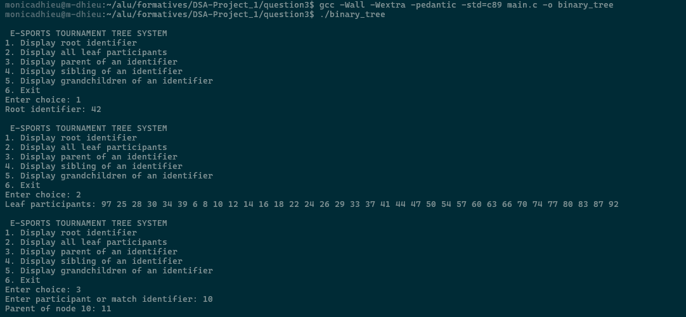
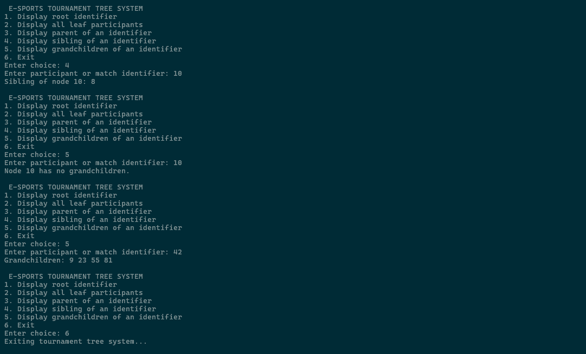

# E-Sports Tournament Tree

This program implements a binary tournament tree for an inter-departmental e-sports tournament. It uses the provided 68 participant identifiers to construct a complete binary tree. The identifiers are inserted level by level from left to right. The tree is dynamically allocated using `malloc()`, and all allocated memory is released using `free()` before the program exits.

The system provides a menu-driven interface for viewing tree relationships and handling invalid input safely. The program also implements `insertNode(Node *root, int id)` for adding a new identifier while maintaining complete-tree level order.

---

## Construction Rule

The program constructs an ordinary complete binary tree from the participant identifiers in the order provided.

For an identifier at array index `i` using zero-based indexing:

- Left child index: `2 * i + 1`
- Right child index: `2 * i + 2`

A child is linked only if its calculated index is within the bounds of the array.

The identifier values are not compared when placing nodes. Their positions depend only on their order in the supplied array. This produces a complete or nearly complete binary tree.

---

## Data Structure

Each tree node contains:

```c
typedef struct Node {
    int id;
    struct Node *left;
    struct Node *right;
} Node;
```

- `id` stores a participant or match identifier
- `left` points to the left child
- `right` points to the right child

The tree does not store parent pointers. Parent and sibling queries search from the root while tracking the parent of the selected node.

---

## Compilation and Execution

```bash
gcc -Wall -Wextra -pedantic -std=c89 main.c -o binary_tree
./binary_tree
```

If your compiler does not support the `-std=c89` option, compile with:

```bash
gcc -Wall -Wextra -pedantic main.c -o binary_tree
```
On Windows run with:

```bash
binary_tree.exe
```

---

## Memory Management

Each tree node is created dynamically with `malloc()`.

The program uses a post-order `freeTree()` traversal before termination:

1. Free the left subtree
2. Free the right subtree
3. Free the current node

This ensures that every dynamically allocated node is released once and prevents memory leaks and dangling pointers.

---

## Algorithm Analysis

### Initial Tree Construction

The initial tree is built from an array of `n` identifiers.

- Each identifier is allocated once.
- Each node is linked to its children once.
- The construction loops each process at most `n` items.

Therefore, initial tree construction takes:

```
O(n)
```

### Identifier Search

The tree is not a Binary Search Tree because identifiers are placed by level order rather than numerical value.

Therefore, searching for a particular identifier may require visiting every node:

```
O(n)
```

Parent, sibling, and grandchild operations first locate the requested identifier. Their total time complexity is therefore dominated by search:

```
O(n)
```

### Leaf Traversal

Displaying all leaves requires visiting the tree:

```
O(n)
```

### Node Insertion Complexity

The program implements an `insertNode(Node *root, int id)` function that inserts a new participant while maintaining a complete binary tree shape in level order.

The insertion strategy is:

1. Perform a level-order traversal (BFS) from the root.
2. Find the first node without a left or right child.
3. Attach the new node as the missing left child; otherwise attach it as the missing right child.

In the worst case, BFS may visit every existing node before finding an available child position. Each visited node requires constant work.

Therefore, for a tree containing `n` nodes:

```
T(n) = O(n)
```

### Tree Shape and Height

For a complete or balanced binary tree:

```
h = O(log n)
```

However, this implementation does not retain parent pointers, a persistent availability queue, or a direct pointer to the next insertion location. It performs BFS from the root for every insertion. Therefore, even though the tree height is `O(log n)`, the insertion algorithm can still inspect `n` nodes:

```
Balanced complete tree insertion: O(n)
```
```
For a degenerate or skewed tree: h = O(n)
```

The level-order traversal may also inspect all nodes:

```
Skewed tree insertion: O(n)
```

Thus, the implemented BFS insertion method has worst-case complexity `O(n)` regardless of the tree shape.

---

## Complexity Summary

| Operation                 | Time Complexity |
|---------------------------|----------------:|
| Initial tree construction | O(n)            |
| Search for identifier     | O(n)	      |
| Display root 		    | O(1) 	      |
| Display all leaves 	    | O(n)            |
| Display parent 	    | O(n)            |
| Display sibling 	    | O(n)            |
| Display grandchildren     | O(n) 	      |
| Insert new node using BFS | O(n) 	      |
| Free entire tree 	    | O(n) 	      |

---

## Boundary Cases

The implementation handles:

- Empty or failed tree construction
- Root node with no parent
- Root node with no sibling
- Leaf nodes with no children or grandchildren
- Nodes with no sibling
- Nodes with no grandchildren
- An identifier not contained in the tree
- Invalid menu input
- Invalid identifier input
- End-of-file input
- Dynamic memory allocation failure
- Safe memory release on exit

---

## Example Usage




