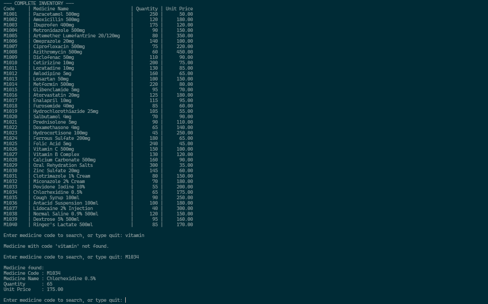
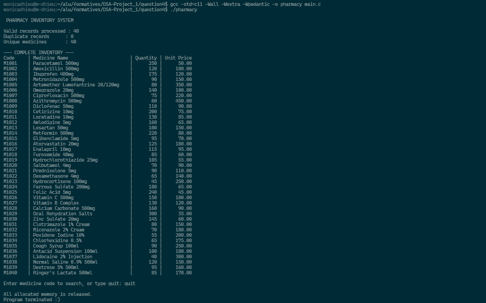

# Pharmacy Inventory System

This project is a pharmacy inventory management system that reads medicine records from a text file and stores them in a Binary Search Tree (BST). Each medicine is identified by a medicine code, which is used as the BST search key.

The system allows pharmacy staff to:

- Load and validate medicine records from `inventory.txt`.
- Store the records dynamically in a BST.
- Search for medicines by medicine code.
- Perform multiple searches without rebuilding the tree.
- Display the complete inventory in ascending medicine-code order.
- Handle duplicate codes, malformed records, and invalid quantities or prices.
- Release all dynamically allocated memory before termination.

The project demonstrates the use of binary search trees, dynamic memory allocation, file processing, input validation, tree traversal, duplicate-key handling, and Big-O complexity analysis. It also compares direct linear file searching with searching an inventory that has already been loaded into memory.

---

## Compilation and Execution

```bash
gcc -std=c11 -Wall -Wextra -Wpedantic -o pharmacy main.c
./pharmacy
```

On Windows compile with:

```bash
gcc -std=c11 -Wall -Wextra -Wpedantic -o pharmacy.exe main.c
```

---

## File Format

```
MedicineCode|MedicineName|Quantity|UnitPrice
```

The medicine code begins with `M` followed by digits. Quantity must be a non-negative integer. Unit price must be a non-negative integer or decimal number.

---

## BST Construction

Each node stores the medicine code, medicine name, quantity, unit price, and left and right child pointers. The medicine code is the key. Smaller keys are inserted to the left and larger keys to the right.

If a duplicate code is found, no second node is created. The latest valid quantity replaces the old quantity. This interprets “update the existing quantity” as replacement, not addition, because the pharmacy does not explicitly say that duplicate records are separate stock deliveries.

---

## Validation

Blank lines, malformed records, invalid codes, empty or oversized names, invalid quantities, invalid prices, overlong records, and out-of-range values are rejected with warnings. File-opening errors, allocation errors, and files containing no valid records are distinguished.

---

## Search and Traversal

The user can perform repeated searches without rebuilding the tree. Existing records are displayed completely; missing codes produce a not-found message. Typing `quit` ends the search loop.

In-order traversal visits left subtree, current node, and right subtree. Since the BST is ordered by medicine code, records are displayed in ascending order.

---

## Algorithm Analysis

Let `n` be the number of unique nodes and `h` the height of the BST. 

Searching takes
```
O(h)
``` 

Best case, when the target is at the root:
```
O(1)
```

Average case, when the tree is reasonably balanced:
```
O(log n)
```

Worst case, when the tree is skewed:
```
O(n)
```

Insertion of `n` records on average takes:
```
O(n log n)
```

and in the worst case:
```
O(n^2)
```

In-order traversal and deallocation each take:
```
O(n)
```

The supplied file is sorted from `M1001` to `M1040`. Inserting it in file order creates a right-skewed ordinary BST. Therefore, for this particular file, construction is `O(n^2)` and searching is `O(n)`.

---

## BST vs Linear File Search

A binary tree allows each node to have at most two children and has no required ordering rule. A binary search tree is a binary tree where keys smaller than a node are placed in the left subtree and keys larger than a node are placed in the right subtree.

A linear file search has no tree construction cost, but each query may require scanning the file from the beginning, giving `O(n)` time per query. For `k` queries, the total search cost is `O(kn)`.

A BST requires a one-time cost to load the records and construct the tree. For a balanced tree, construction is `O(n log n)` and each search is `O(log n)`, giving `O(n log n + k log n)` for `k` searches. For a skewed tree, construction can be `O(n^2)` when records are inserted in an already sorted order, and each search can take `O(n)`.

Therefore, the BST approach can reduce the cost of repeated searches because the inventory is loaded once and subsequent queries use the tree rather than rescanning the file. The benefit is greatest when the tree remains reasonably balanced and many searches are performed on the same inventory.

---

## Memory Management

Every BST node is allocated dynamically using malloc(). Allocation failures are detected and propagated during recursive insertion. If allocation fails while loading the inventory, the file is closed and all nodes already allocated in the tree are released.

The freeTree() function recursively releases every node after the search loop ends, ensuring that all dynamically allocated memory is released before normal program termination.

---

## Example Output




